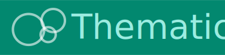
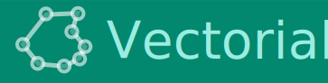
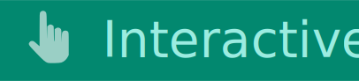
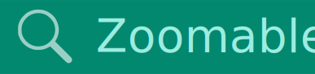

    

# Geoviz JavaScript library

</img>


`geoviz` is a JavaScript library for designing thematic maps. The library provides a set of [d3](https://github.com/d3/d3) compatible functions that you can mix with the usual d3 syntax. The library is designed to be intuitive and concise. It allow to manage different geographic layers (points, lines, polygons) and marks (circles, labels, scale bar, title, north arrow, etc.) to design pretty maps. Its use is particularly well suited to Observable notebooks. Maps deigned with `geoviz` are:

      

## Installation

In the browser

```html
<script src="https://cdn.jsdelivr.net/npm/geoviz" charset="utf-8"></script>
```

In Observable

~~~js
geoviz = require("geoviz")
~~~

## Documentation

- [API documentation](https://riatelab.github.io/geoviz)
- [Live examples](https://observablehq.com/@neocartocnrs/geoviz)