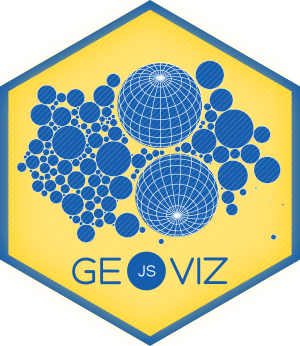

    



# Geoviz JavaScript library

`geoviz` is a d3-based JavaScript library for designing thematic maps. The library provides a set of [d3](https://github.com/d3/d3) compatible functions that you can mix with the usual d3 syntax. In [Observable](https://observablehq.com/), this library allows you to split map layers into different cells.

## Installation

In the browser

```html
<script src="https://cdn.jsdelivr.net/npm/geoviz" charset="utf-8"></script>
```

In Observable

~~~js
geoviz = require("geoviz")
~~~

### Usage

**1 - Simple map**

~~~js
let geojson =   "./world.json"
d3.json(geojson).then(data => {
let svg = geoviz.container.create({projection: d3.geoEqualEarth())
svg.layer.outline({fill: "#267A8A"})
svg.layer.graticule({stroke: "white", strokeWidth: 0.4})
svg.layer.geopath({data: data, fill: "#F8D993", stroke: "#ada9a6", strokeWidth:0.5})
document.body.appendChild(svg.render())
~~~

Demo: [simple.html](https://neocarto.github.io/geoviz/examples/simple.html)

**2 - Circles**

~~~js
let geojson =   "./world.json"
d3.json(geojson).then(data => {
let svg = geoviz.container.create({projection: d3.geoEqualEarth()})
svg.layer.geopath({data: data, fill: "white", fillOpacity:0.4})
let centroids = geoviz.transform.centroid(data)
svg.layer.circle({data: centroids, r: "pop", fill: "#f07d75"})
document.body.appendChild(svg.render())
~~~

Demo: [bubble.html](https://neocarto.github.io/geoviz/examples/bubble.html) & [dorling.html](https://neocarto.github.io/geoviz/examples/dorling.html)

**3 - Choropleth**

~~~js
let geojson =   "./world.json"
d3.json(geojson).then(data => {
let svg = geoviz.container.create({projection: d3.geoEqualEarth()})
let choro = geoviz.classify.choro(data.features.map((d) => d.properties.gdppc))
svg.layer.geopath({data: data, fill: d =>  choro.colorize(d.properties.gdppc)})
document.body.appendChild(svg.render())
~~~

Demo: [choropleth.html](https://neocarto.github.io/geoviz/examples/choropleth.html)

**4 - Typology**

~~~js
let geojson =   "./world.json"
d3.json(geojson).then(data => {
let svg = geoviz.container.create({projection: d3.geoEqualEarth())
let typo = geoviz.classify.typo(data.features.map((d) => d.properties.region));
svg.layer.geopath({data: data, fill: (d) => typo.colorize(d.properties.region) })
document.body.appendChild(svg.render())
})
~~~

**5 - Zoomable tiles**

~~~js
let geojson =   "./world.json"
d3.json(geojson).then(data => {
let svg = geoviz.container.create({projection: d3.geoMercator(), zoomable:true})
svg.layer.tile()
svg.layer.geopath({datum: world, fill:"none", stroke:"black"})
document.body.appendChild(svg.render())
})
~~~

Demo: [typo.html](https://neocarto.github.io/geoviz/examples/tiles.html)

### Live Examples

You can find several live examples of how to use the library on the [observable platform](https://observablehq.com/collection/@neocartocnrs/bergeoviztin)

### Api documentation

See [documentation](https://neocarto.github.io/geoviz/docs)
