    

# Geoviz JavaScript library

</img>

**Tags** `#cartography` `#maps` `#geoviz` `#dataviz` `#JSspatial` `#Observable` `#FrontEndCartography`  

`geoviz` is a JavaScript library for designing thematic maps. The library provides a set of [d3](https://github.com/d3/d3) compatible functions that you can mix with the usual d3 syntax. The library is designed to be intuitive and concise. It allow to manage different geographic layers (points, lines, polygons) and marks (circles, labels, scale bar, title, north arrow, etc.) to design pretty maps. Its use is particularly well suited to Observable notebooks. Maps deigned with `geoviz` are:

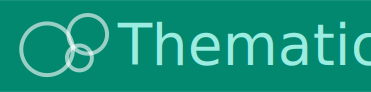  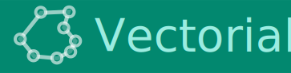    

💻 Source code [`github`](https://github.com/riatelab/geoviz)

💡 Suggestions/bugs [`issues`](https://github.com/riatelab/geoviz/issues)

</img>

# Installation

In the browser (CDN, global variable)

```html
<script src="https://cdn.jsdelivr.net/npm/geoviz" charset="utf-8"></script>
```

In the browser (ES modules)

~~~js
<script type="module">
import * as geoviz from "https://cdn.jsdelivr.net/npm/geoviz/+esm";
</script>
~~~

With a bundler (Vite, Webpack, etc.)

~~~js
npm install geoviz
~~~

In [Observable](https://observablehq.com/) notebooks

~~~js
geoviz = require("geoviz")
~~~

# Examples

There are many examples of maps created with `geoviz`.

</img>

Find here some of them:

> *Vanilla JS: [A simple map](https://riatelab.github.io/geoviz/examples/simple.html), [A globe](https://riatelab.github.io/geoviz/examples/globe.html), [Proportionnal symbols](https://riatelab.github.io/geoviz/examples/bubble.html), [Choropleth](https://riatelab.github.io/geoviz/examples/choropleth.html), [Typology](https://riatelab.github.io/geoviz/examples/typo.html), [Dorling cartogram](https://riatelab.github.io/geoviz/examples/dorling.html), [Mercator tiles](https://riatelab.github.io/geoviz/examples/tiles.html), [Interactive map](https://riatelab.github.io/geoviz/examples/reactive.html). (code source available [here](https://github.com/riatelab/geoviz/tree/main/examples))*

> *Observable notebooks: [Dorling cartogram](https://observablehq.com/@neocartocnrs/world-population), [Ridge lines](https://observablehq.com/@neocartocnrs/ridge-lines), [Mapping gw4 population grid](https://observablehq.com/@neocartocnrs/mapping-gw4), [Electricity map](https://observablehq.com/@neocartocnrs/electricity-map), [Hand-drawn map](https://observablehq.com/@neocartocnrs/lets-draw-a-sketch-map), [International migrations](https://observablehq.com/@neocartocnrs/migrexplorer), [Night and day](https://observablehq.com/@neocartocnrs/night-and-day), [Mushroom map](https://observablehq.com/@neocartocnrs/migreurop-explusions-et-oqt), [Loxodromy vs orthodromy](https://observablehq.com/@neocartocnrs/great-circle-vs-rhumb-lines), etc. See All notebooks [here](https://observablehq.com/@neocartocnrs)*

> *In the newspaper L'Humanité: ["Le regard du cartographe"](https://www.humanite.fr/serie/le-regard-du-cartographe)  (in french)*

# Syntax

There are several steps involved in creating a map with geoviz.

**1** - First, create the map container using the `create()` function. This is where you define the projection, margins, background color, etc. In short, all the general parameters of the map.

**2** The next step is to progressively add layers. A set of dedicated functions is available for this purpose. For instance, `path` adds a spatial dataframe, `graticule` draws latitude and longitude lines, `header` inserts a title, and `footer` adds a source note.

**3** - Then, the `render()` function displays the map

For example:

~~~js
let svg = geoviz.create({projection: "Bertin1953", zoomable: true})
svg.outline()
svg.graticule()
svg.path({data: **a geoJSON**})
svg.header({text : "Hello geoviz"})
svg.render()
~~~

Here's an example that works in vanilla JS. Copy this code into an `.html` file and open it in your web browser.

~~~js
<script type="module">
  import * as geoviz from "https://cdn.jsdelivr.net/npm/geoviz/+esm";
  let geojson =
    "https://raw.githubusercontent.com/riatelab/geoviz/refs/heads/main/examples/world.json";
  fetch(geojson)
    .then((res) => res.json())
    .then((data) => {
      let svg = geoviz.create({ projection: "Bertin1953", zoomable: true });
      svg.outline();
      svg.graticule();
      svg.path({ data: data });
      svg.header({ text: "Hello geoviz" });
      document.body.appendChild(svg.render());
    });
</script>
~~~

There are several ways to build maps with geoviz. Multiple syntaxes are possible. 

**Classic style** 

~~~js
let svg = geoviz.create({projection: "Polar"})
geoviz.outline(svg, {fill: "#5abbe8"})
geoviz.graticule(svg, {stroke: "white", step: 30})
geoviz.path(svg, {data: **a geoJSON**, fill: "#38896F"})
geoviz.render(svg)
~~~

**Light style**

~~~js
let svg = geoviz.create({projection: "Polar"})
svg.outline({fill: "#5abbe8"})
svg.graticule({stroke: "white", step: 30})
svg.path({data: **a geoJSON**, fill: "#38896F"})
svg.render()
~~~

**With the `plot()` function**

~~~js
let svg = geoviz.create({projection: "Polar"})
svg.plot({type: "outline", fill: "#5abbe8"})
svg.plot({type: "graticule", stroke: "white", step: 30})
svg.plot({type:"path", data: **a geoJSON**, fill: "#38896F"})
svg.render()
~~~

**With the `draw()` function**

~~~js
geoviz.draw({
  params: { projection: "Polar" },
  layers: [
    { type: "outline", fill: "#5abbe8" },
    { type: "graticule", stroke: "white", step: 30 },
    { type: "path", data: **a geoJSON**, fill: "#38896F" }
  ]
});
~~~

Use whichever one you prefer.

# Create & render

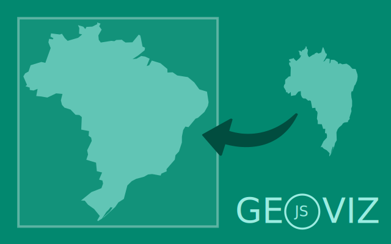</img>

**These functions are essential for initializing a map, visualizing its content, and exporting it. They form the core workflow for creating maps with the geoviz library.**

- **[`create()`](https://riatelab.github.io/geoviz/global.html#create)** : Create a geoviz map container  
- **[`render()`](https://riatelab.github.io/geoviz/global.html#render)** : Render the map  
- **[`exportPNG()`](https://riatelab.github.io/geoviz/global.html#exportPNG)** : Returns the map as a PNG file  
- **[`exportSVG()`](https://riatelab.github.io/geoviz/global.html#exportSVG)** : Returns the map as an SVG file

> *Observable notebooks: [Hello geoviz](https://observablehq.com/@neocartocnrs/geoviz), [Map containers](https://observablehq.com/@neocartocnrs/containers), [Export](https://observablehq.com/@neocartocnrs/export), [Draw](https://observablehq.com/@neocartocnrs/geoviz-draw)*

# Base Map and Structure

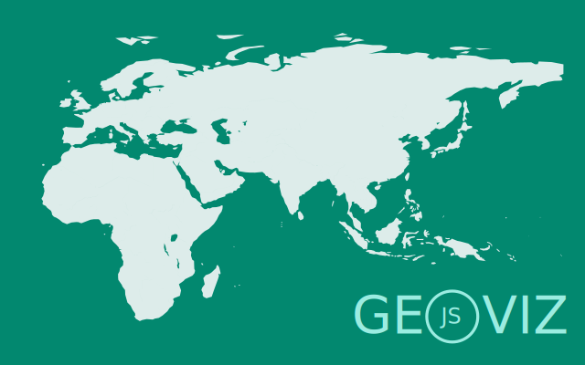</img>

**Functions that define the map’s geographic content, including outlines, tiles, and graticules.**

- **[`path()`](https://riatelab.github.io/geoviz/global.html#path)** : Add a GeoJSON layer  
- **[`outline()`](https://riatelab.github.io/geoviz/global.html#outline)** : Earth outline in the projection  
- **[`graticule()`](https://riatelab.github.io/geoviz/global.html#graticule)** : Graticule (latitude and longitude lines)  
- **[`tissot()`](https://riatelab.github.io/geoviz/global.html#tissot)** : Tissot indicatrices  
- **[`earth()`](https://riatelab.github.io/geoviz/global.html#earth)** : Natural Earth basemap  
- **[`tile()`](https://riatelab.github.io/geoviz/global.html#tile)** : Mercator tiles  

> *Observable notebooks: [Path](https://observablehq.com/@neocartocnrs/path-mark), [Earth](https://observablehq.com/@neocartocnrs/earth), [Tile](https://observablehq.com/@neocartocnrs/tile-mark)*

> *Vanilla JS: [Tiles](https://riatelab.github.io/geoviz/examples/tiles.html)*

# Map Decorations and Annotations

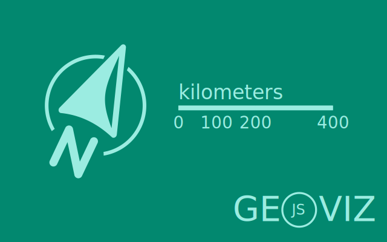</img>

**Functions for styling and annotating the map, such as titles, scale bars, and north arrows.**

- **[`header()`](https://riatelab.github.io/geoviz/global.html#header)** : Map title  
- **[`footer()`](https://riatelab.github.io/geoviz/global.html#footer)** : Map source  
- **[`north()`](https://riatelab.github.io/geoviz/global.html#north)** : North arrow  
- **[`scalebar()`](https://riatelab.github.io/geoviz/global.html#scalebar)** : Scale bar  
- **[`text()`](https://riatelab.github.io/geoviz/global.html#text)** : Texts and labels  
- **[`minimap()`](https://riatelab.github.io/geoviz/global.html#minimap)** : Location map  
- **[`empty()`](https://riatelab.github.io/geoviz/global.html#empty)** : Empty layer with id  
- **[`pattern()`](https://riatelab.github.io/geoviz/global.html#pattern)** : Pattern layer  
- **[`sketch()`](https://riatelab.github.io/geoviz/global.html#sketch)** : Sketch layer  
- **[`rhumbs()`](https://riatelab.github.io/geoviz/global.html#rhumbs)** : Rhumb lines (loxodromes) 

> *Observable notebooks: [Layout](https://observablehq.com/@neocartocnrs/layout-marks), [Insets](https://observablehq.com/@neocartocnrs/insets), [Sketch](https://observablehq.com/@neocartocnrs/sketch), [Pattern](https://observablehq.com/@neocartocnrs/patterns), [Labels](https://observablehq.com/@neocartocnrs/text-mark)*

# Thematic

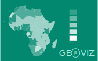</img>

**These functions allow the creation of thematic maps based on statistical data, complete with their associated legends.**

- **[`prop()`](https://riatelab.github.io/geoviz/global.html#prop)** : Proportional symbols layer  
- **[`choro()`](https://riatelab.github.io/geoviz/global.html#choro)** : Choropleth layer  
- **[`typo()`](https://riatelab.github.io/geoviz/global.html#typo)** : Typology layer  
- **[`propchoro()`](https://riatelab.github.io/geoviz/global.html#propchoro)** : Combined proportional + choropleth layer  
- **[`proptypo()`](https://riatelab.github.io/geoviz/global.html#proptypo)** : Combined proportional + typology layer  
- **[`picto()`](https://riatelab.github.io/geoviz/global.html#picto)** : Pictogram layer  

> *Observable notebooks: [Proportionnal symbols](https://observablehq.com/@neocartocnrs/prop), [Choropleth](https://observablehq.com/@neocartocnrs/choropleth), [Typology](https://observablehq.com/@neocartocnrs/typo), [Pictograms](https://observablehq.com/@neocartocnrs/symbols)*

> *Vanilla JS: [Proportionnal symbols](https://riatelab.github.io/geoviz/examples/bubble.html), [Choropleth](https://riatelab.github.io/geoviz/examples/choropleth.html), [Typology](https://riatelab.github.io/geoviz/examples/typo.html)*

# Thematic (advanced)

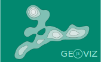</img>

**These functions allow the creation of advanced thematic maps based on statistical data, complete with their associated legends.**

- **[`gridprop()`](https://riatelab.github.io/geoviz/global.html#gridprop)** : Grid-based proportional symbols layer  
- **[`gridchoro()`](https://riatelab.github.io/geoviz/global.html#gridchoro)** : Grid-based choropleth layer  
- **[`smooth()`](https://riatelab.github.io/geoviz/global.html#smooth)** : Smoothed density (isobands) layer  
- **[`dotdensity()`](https://riatelab.github.io/geoviz/global.html#dotdensity)** : Dot density layer  sity)

> *Observable notebooks: [Smooth](https://observablehq.com/@neocartocnrs/contour), [Grid](https://observablehq.com/@neocartocnrs/regular-grids), [Dot density](https://observablehq.com/@neocartocnrs/dotdensity)*

# Marks

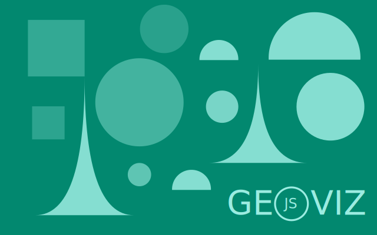</img>

**Behind the symbolization functions, there are elementary graphical marks. In geoviz, it is possible to use them directly.**

- **[`circle()`](https://riatelab.github.io/geoviz/global.html#circle)** : Circle layer  
- **[`square()`](https://riatelab.github.io/geoviz/global.html#square)** : Square layer  
- **[`spike()`](https://riatelab.github.io/geoviz/global.html#spike)** : Spike layer  
- **[`halfcircle()`](https://riatelab.github.io/geoviz/global.html#halfcircle)** : Half-circle layer  
- **[`symbol()`](https://riatelab.github.io/geoviz/global.html#symbol)** : Symbol layer 
- **[`contour()`](https://riatelab.github.io/geoviz/global.html#contour)** : Contour layer


> *Observable notebooks: [Circles](https://observablehq.com/@neocartocnrs/circle-mark), [Squares](https://observablehq.com/@neocartocnrs/square-mark), [Half circles](https://observablehq.com/@neocartocnrs/half-circle-mark), [Spikes](https://observablehq.com/@neocartocnrs/spike-mark), [Texts](https://observablehq.com/@neocartocnrs/text-mark), [Symbols](https://observablehq.com/@neocartocnrs/symbols)*


# Effects

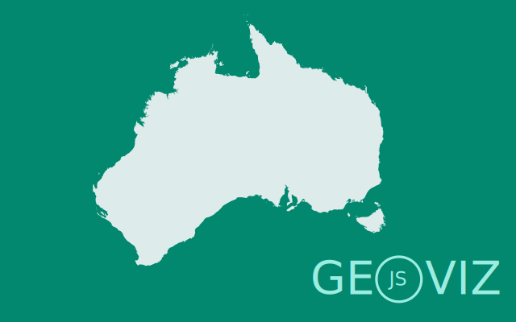</img>

**Since the maps created are in SVG format, it is possible to apply filters to them. These functions offer four different options for doing so.**

- **[`effect.shadow()`](https://riatelab.github.io/geoviz/global.html#effect/shadow)** : Shadow effect  
- **[`effect.blur()`](https://riatelab.github.io/geoviz/global.html#effect/blur)** : Blur effect  
- **[`effect.clipPath()`](https://riatelab.github.io/geoviz/global.html#effect/clipPath)** : ClipPath layer  
- **[`effect.radialGradient()`](https://riatelab.github.io/geoviz/global.html#effect/radialGradient)** : Radial gradient  

> *Observable notebooks: [SVG filters and clip](https://observablehq.com/@neocartocnrs/effect)*

# Interactivity

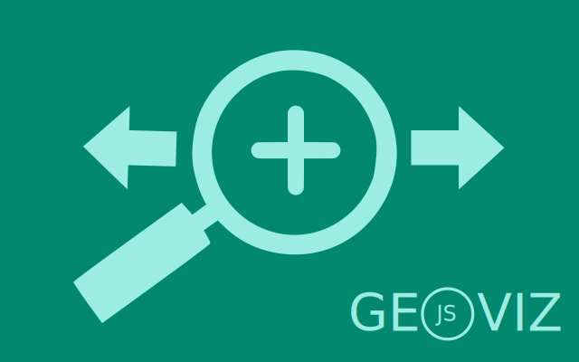</img>

**Maps created with geoviz are interactive**

The maps are zoomable (two zoom modes are available). Custom tooltips can be displayed on hover over individual features. Even geometry simplification can dynamically adapt depending on the zoom level.

> *Observable notebooks: [Tooltip](https://observablehq.com/@neocartocnrs/tooltip), [Pan and zoom](https://observablehq.com/@neocartocnrs/zooming), [Interactivity](https://observablehq.com/@neocartocnrs/interactivity), [Mercator tiles](https://observablehq.com/@neocartocnrs/tile-mark), [Dynamic simplification](https://observablehq.com/@neocartocnrs/dynamic-simplify)*

> *Vanilla JS: [An interactive map](https://riatelab.github.io/geoviz/examples/reactive.html).*

# Legends

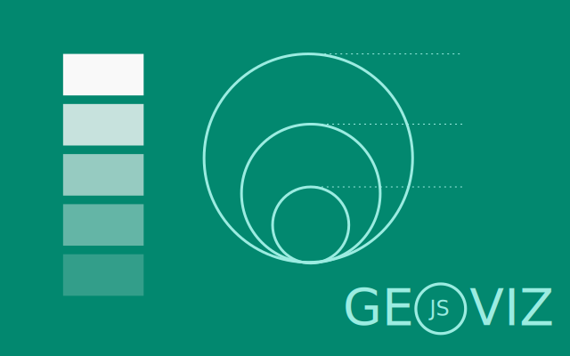</img>

**Functions to design map legends.**

- **[`legend.box()`](https://riatelab.github.io/geoviz/global.html#legend/box)** : Add a box legend  
- **[`legend.typo_vertical()`](https://riatelab.github.io/geoviz/global.html#legend/typo_vertical)** : Vertical typology legend  
- **[`legend.typo_horizontal()`](https://riatelab.github.io/geoviz/global.html#legend/typo_horizontal)** : Horizontal typology legend  
- **[`legend.choro_horizontal()`](https://riatelab.github.io/geoviz/global.html#legend/choro_horizontal)** : Horizontal choropleth legend  
- **[`legend.choro_vertical()`](https://riatelab.github.io/geoviz/global.html#legend/choro_vertical)** : Vertical choropleth legend  
- **[`legend.gradient_vertical()`](https://riatelab.github.io/geoviz/global.html#legend/gradient_vertical)** : Vertical gradient legend  
- **[`legend.spikes()`](https://riatelab.github.io/geoviz/global.html#legend/spikes)** : Spike legend  
- **[`legend.circles()`](https://riatelab.github.io/geoviz/global.html#legend/circles)** : Proportional circles legend  
- **[`legend.circles_nested()`](https://riatelab.github.io/geoviz/global.html#legend/circles_nested)** : Nested proportional circles legend  
- **[`legend.squares()`](https://riatelab.github.io/geoviz/global.html#legend/squares)** : Proportional squares legend  
- **[`legend.squares_nested()`](https://riatelab.github.io/geoviz/global.html#legend/squares_nested)** : Nested proportional squares legend  
- **[`legend.mushrooms()`](https://riatelab.github.io/geoviz/global.html#legend/mushrooms)** : Proportional half-circles (mushrooms) legend  
- **[`legend.symbol_vertical()`](https://riatelab.github.io/geoviz/global.html#legend/symbol_vertical)** : Vertical symbol legend  
- **[`legend.symbol_horizontal()`](https://riatelab.github.io/geoviz/global.html#legend/symbol_horizontal)** : Horizontal symbol legend  

> *Observable notebooks: [Legends](https://observablehq.com/@neocartocnrs/legends)*

# Tools

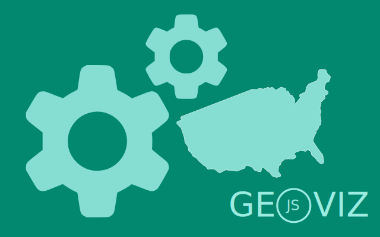</img>

**Geoviz also provides many useful functions for thematic cartography.**

<ins>Quick view.</ins>

- **[`view()`](https://riatelab.github.io/geoviz/global.html#view)** :  allows you to quickly display one or more layers with an OpenStreetMap background.

<ins>Join data with the basemap.</ins>

- **[`tool.merge()`](https://riatelab.github.io/geoviz/global.html#tool/merge)** : Joins a GeoJSON with an external dataset (returns a GeoJSON FeatureCollection and a diagnostic)  

<ins>Clean and handle GeoJSONs.</ins>

- **[`tool.featurecollection()`](https://riatelab.github.io/geoviz/global.html#tool/featurecollection)** : Builds a valid GeoJSON FeatureCollection from geometries, features, or coordinates  
- **[`tool.geotable()`](https://riatelab.github.io/geoviz/global.html#tool/geotable)** : Converts a GeoJSON FeatureCollection into an array of objects  
- **[`tool.cleangeometry()`](https://riatelab.github.io/geoviz/global.html#tool/cleangeometry)** : Simplify GeoJSON with optional validity and rewind
- **[`tool.rewind()`](https://riatelab.github.io/geoviz/global.html#tool/rewind)** :  Rewind a GeoJSON FeatureCollection. A homemade approach that tries to work in most cases.

<ins>Operations on geometries</ins>

- **[`tool.centroid()`](https://riatelab.github.io/geoviz/global.html#tool/centroid)** : Computes centroids of geometries in a FeatureCollection  
- **[`tool.dissolve()`](https://riatelab.github.io/geoviz/global.html#tool/dissolve)** : Converts multipart geometries into single-part features  
- **[`tool.ridge()`](https://riatelab.github.io/geoviz/global.html#tool/ridge)** : Converts gridded (x, y, z) data into LineString features for ridgeline maps  
- **[`tool.grid()`](https://riatelab.github.io/geoviz/global.html#tool/grid)** : Generates a regular grid as a GeoJSON object  
- **[`tool.dodge()`](https://riatelab.github.io/geoviz/global.html#tool/dodge)** : Uses force simulation to spatially separate points (e.g., Dorling cartograms)  
- **[`tool.dotstogrid()`](https://riatelab.github.io/geoviz/global.html#tool/dotstogrid)** : Builds a grid and counts points per cell (dot-density preparation)  
- **[`tool.randompoints()`](https://riatelab.github.io/geoviz/global.html#tool/randompoints)** : Generates random points inside polygons (dot-density method)  
- **[`tool.replicate()`](https://riatelab.github.io/geoviz/global.html#tool/replicate)** : Creates dot cartograms with overlapping features  

<ins>Projections</ins>

- **[`tool.project()`](https://riatelab.github.io/geoviz/global.html#tool/project)** : Projects GeoJSON using d3-geo-projection  
- **[`tool.unproject()`](https://riatelab.github.io/geoviz/global.html#tool/unproject)** : Unprojects geometries to WGS84 (returns a GeoJSON FeatureCollection)  
- **[`tool.proj4d3()`](https://riatelab.github.io/geoviz/global.html#tool/proj4d3)** : Enables use of proj4 projections with d3 (Philippe Rivière)  

<ins>Styling</ins>

- **[`tool.addonts()`](https://riatelab.github.io/geoviz/global.html#tool/addonts)** : Adds fonts to the document from a URL  
- **[`tool.random()`](https://riatelab.github.io/geoviz/global.html#tool/random)** : Returns a random color from a predefined palette (20 colors)  

<ins>Cartographic helpers</ins>

- **[`tool.choro()`](https://riatelab.github.io/geoviz/global.html#tool/choro)** : Classifies numeric arrays into choropleth breaks and colors  
- **[`tool.typo()`](https://riatelab.github.io/geoviz/global.html#tool/typo)** : Assigns colors to categorical data for typology maps  
- **[`tool.radius()`](https://riatelab.github.io/geoviz/global.html#tool/radius)** : Returns a function to compute circle radii from data  
- **[`tool.height()`](https://riatelab.github.io/geoviz/global.html#tool/height)** : Returns a function to compute height scaling (similar to radius scaling)  

<ins>Map update</ins>

- **[`attr()`](https://riatelab.github.io/geoviz/global.html#attr)** :  Modify one or multiple layers in one or more SVG maps with a D3 transition.

> *Observable notebooks: [Map projections](https://observablehq.com/@neocartocnrs/map-projections), [Handle geometries](https://observablehq.com/@neocartocnrs/handle-geometries)*

# Related libraries

- **[`geotoolbox`](https://riatelab.github.io/geotoolbox)** : This library provides several useful GIS operations for thematic cartography. Under the hood, `geotoolbox` is largely based on `geos-wasm` GIS operators (a big thanks to Christoph Pahmeyer 🙏), but also on `d3.geo` and `topojson`. 
- **[`geogrid`](https://neocarto.github.io/geogrid)** : This library that allows you to create regular grids with various patterns on a flat plane or on the globe. In addition, it provides geoprocessing functions to transfer GeoJSON data (points, lines, or polygons) onto these grids.
- **[`geoviz (R version)`](https://riatelab.github.io/geoviz_R)** : Geoviz is also available in R language