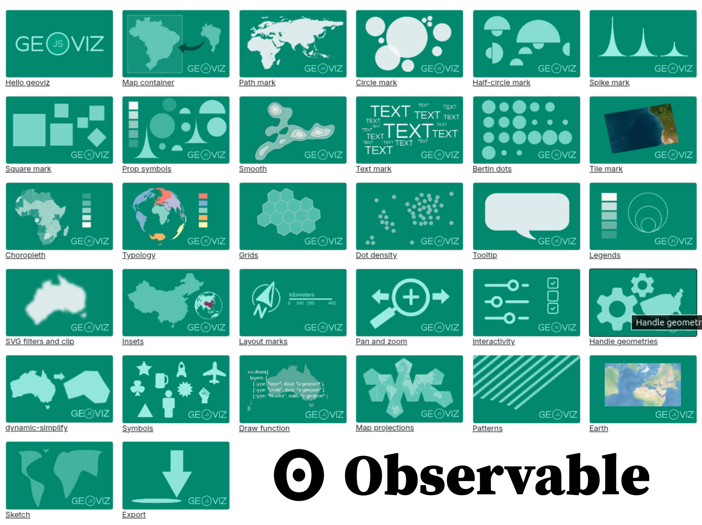

    

# Geoviz JavaScript library

</img>

**Tags** `#cartography` `#maps` `#geoviz` `#dataviz` `#JSspatial` `#Observable` `#FrontEndCartography`  

`geoviz` is a JavaScript library for designing thematic maps. The library provides a set of [d3](https://github.com/d3/d3) compatible functions that you can mix with the usual d3 syntax. The library is designed to be intuitive and concise. It allow to manage different geographic layers (points, lines, polygons) and marks (circles, labels, scale bar, title, north arrow, etc.) to design pretty maps. Its use is particularly well suited to Observable notebooks. Maps deigned with `geoviz` are:

      

🌏 live demo [`Observable notebook`](https://observablehq.com/@neocartocnrs/geoviz)

💻 Source code [`github`](https://github.com/riatelab/geoviz)

💡 Suggestions/bugs [`issues`](https://github.com/riatelab/geoviz/issues)

</img>


# Installation

In the browser (CDN, global variable)

```html
<script src="https://cdn.jsdelivr.net/npm/geoviz" charset="utf-8"></script>
```

In the browser (ES modules)

~~~js
<script type="module">
import * as geoviz from "https://cdn.jsdelivr.net/npm/geoviz/+esm";
</script>
~~~

With a bundler (Vite, Webpack, etc.)

~~~js
npm install geoviz
~~~

In [Observable](https://observablehq.com/) notebooks

~~~js
geoviz = require("geoviz")
~~~


# Examples

To see what can be done with the geoviz library, many examples have been developed on the Observable platform. Click on the image below to access them.

<a href = "https://observablehq.com/@neocartocnrs/geoviz" target = "_BLANK"></img></a>

# Syntax

There are several steps involved in creating a map with geoviz.

**1** - First, create the map container using the `create()` function. This is where you define the projection, margins, background color, etc. In short, all the general parameters of the map.

**2** The next step is to progressively add layers. A set of dedicated functions is available for this purpose. For instance, `path` adds a spatial dataframe, `graticule` draws latitude and longitude lines, `header` inserts a title, and `footer` adds a source note.

**3** - Then, the `render()` function displays the map

For example:

~~~js
let svg = geoviz.create({projection: "Bertin1953", zoomable: true})
svg.outline()
svg.graticule()
svg.path({data: **a geoJSON**})
svg.header({text : "Hello geoviz"})
svg.render()
~~~

Here's an example that works in vanilla JS. Copy this code into an `.html` file and open it in your web browser.

~~~js
<script type="module">
  import * as geoviz from "https://cdn.jsdelivr.net/npm/geoviz/+esm";
  let geojson =
    "https://raw.githubusercontent.com/riatelab/geoviz/refs/heads/main/examples/world.json";
  fetch(geojson)
    .then((res) => res.json())
    .then((data) => {
      let svg = geoviz.create({ projection: "Bertin1953", zoomable: true });
      svg.outline();
      svg.graticule();
      svg.path({ data: data });
      svg.header({ text: "Hello geoviz" });
      document.body.appendChild(svg.render());
    });
</script>
~~~

There are several ways to build maps with geoviz. Multiple syntaxes are possible. 

**Classic style** 

~~~js
let svg = geoviz.create({projection: "Polar"})
geoviz.outline(svg, {fill: "#5abbe8"})
geoviz.graticule(svg, {stroke: "white", step: 30})
geoviz.path(svg, {data: **a geoJSON**, fill: "#38896F"})
geoviz.render(svg)
~~~

**Light style**

~~~js
let svg = geoviz.create({projection: "Polar"})
svg.outline({fill: "#5abbe8"})
svg.graticule({stroke: "white", step: 30})
svg.path({data: **a geoJSON**, fill: "#38896F"})
svg.render()
~~~

**With the `plot()` function**

~~~js
let svg = geoviz.create({projection: "Polar"})
svg.plot({type: "outline", fill: "#5abbe8"})
svg.plot({type: "graticule", stroke: "white", step: 30})
svg.plot({type:"path", data: **a geoJSON**, fill: "#38896F"})
svg.render()
~~~

**With the `draw()` function**

~~~js
geoviz.draw({
  params: { projection: "Polar" },
  layers: [
    { type: "outline", fill: "#5abbe8" },
    { type: "graticule", stroke: "white", step: 30 },
    { type: "path", data: **a geoJSON**, fill: "#38896F" }
  ]
});
~~~

Use whichever one you prefer.

# Create & render

**These functions are essential for initializing a map, visualizing its content, and exporting it. They form the core workflow for creating maps with the geoviz library.**

- **[`create()`](https://riatelab.github.io/geoviz/global.html#create)** : Create a geoviz map container  
- **[`render()`](https://riatelab.github.io/geoviz/global.html#render)** : Render the map  
- **[`exportPNG()`](https://riatelab.github.io/geoviz/global.html#exportPNG)** : Returns the map as a PNG file  
- **[`exportSVG()`](https://riatelab.github.io/geoviz/global.html#exportSVG)** : Returns the map as an SVG file  

# Base Map and Structure

**Functions that define the map’s geographic content, including outlines, tiles, and graticules.**

- **[`path()`](https://riatelab.github.io/geoviz/global.html#path)** : Add a GeoJSON layer  
- **[`outline()`](https://riatelab.github.io/geoviz/global.html#outline)** : Earth outline in the projection  
- **[`graticule()`](https://riatelab.github.io/geoviz/global.html#graticule)** : Graticule (latitude and longitude lines)  
- **[`rhumbs()`](https://riatelab.github.io/geoviz/global.html#rhumbs)** : Rhumb lines (loxodromes)  
- **[`tissot()`](https://riatelab.github.io/geoviz/global.html#tissot)** : Tissot indicatrices  
- **[`earth()`](https://riatelab.github.io/geoviz/global.html#earth)** : Natural Earth basemap  
- **[`tile()`](https://riatelab.github.io/geoviz/global.html#tile)** : Mercator tiles  

# Map Decorations and Annotations

**Functions for styling and annotating the map, such as titles, scale bars, and north arrows.**

- **[`header()`](https://riatelab.github.io/geoviz/global.html#header)** : Map title  
- **[`footer()`](https://riatelab.github.io/geoviz/global.html#footer)** : Map source  
- **[`north()`](https://riatelab.github.io/geoviz/global.html#north)** : North arrow  
- **[`scalebar()`](https://riatelab.github.io/geoviz/global.html#scalebar)** : Scale bar  
- **[`text()`](https://riatelab.github.io/geoviz/global.html#text)** : Texts and labels  
- **[`minimap()`](https://riatelab.github.io/geoviz/global.html#minimap)** : Location map  
- **[`empty()`](https://riatelab.github.io/geoviz/global.html#empty)** : Empty layer with id  
- **[`pattern()`](https://riatelab.github.io/geoviz/global.html#pattern)** : Pattern layer  
- **[`sketch()`](https://riatelab.github.io/geoviz/global.html#sketch)** : Sketch layer  

# Thematic

**These functions allow the creation of thematic maps based on statistical data, complete with their associated legends.**

- **[`prop()`](https://riatelab.github.io/geoviz/global.html#prop)** : Proportional symbols layer  
- **[`choro()`](https://riatelab.github.io/geoviz/global.html#choro)** : Choropleth layer  
- **[`typo()`](https://riatelab.github.io/geoviz/global.html#typo)** : Typology layer  
- **[`propchoro()`](https://riatelab.github.io/geoviz/global.html#propchoro)** : Combined proportional + choropleth layer  
- **[`proptypo()`](https://riatelab.github.io/geoviz/global.html#proptypo)** : Combined proportional + typology layer  
- **[`picto()`](https://riatelab.github.io/geoviz/global.html#picto)** : Pictogram layer  

# Thematic (advanced)

**These functions allow the creation of advanced thematic maps based on statistical data, complete with their associated legends.**

- **[`gridprop()`](https://riatelab.github.io/geoviz/global.html#gridprop)** : Grid-based proportional symbols layer  
- **[`gridchoro()`](https://riatelab.github.io/geoviz/global.html#gridchoro)** : Grid-based choropleth layer  
- **[`smooth()`](https://riatelab.github.io/geoviz/global.html#smooth)** : Smoothed density (isobands) layer  
- **[`dotdensity()`](https://riatelab.github.io/geoviz/global.html#dotdensity)** : Dot density layer  sity)

# Marks

**Behind the symbolization functions, there are elementary graphical marks. In geoviz, it is possible to use them directly.**

- **[`circle()`](https://riatelab.github.io/geoviz/global.html#circle)** : Circle layer  
- **[`square()`](https://riatelab.github.io/geoviz/global.html#square)** : Square layer  
- **[`spike()`](https://riatelab.github.io/geoviz/global.html#spike)** : Spike layer  
- **[`halfcircle()`](https://riatelab.github.io/geoviz/global.html#halfcircle)** : Half-circle layer  
- **[`symbol()`](https://riatelab.github.io/geoviz/global.html#symbol)** : Symbol layer 
- **[`contour()`](https://riatelab.github.io/geoviz/global.html#contour)** : Contour layer
# Effects

**Since the maps created are in SVG format, it is possible to apply filters to them. These functions offer four different options for doing so.**

- **[`effect.shadow()`](https://riatelab.github.io/geoviz/global.html#effect/shadow)** : Shadow effect  
- **[`effect.blur()`](https://riatelab.github.io/geoviz/global.html#effect/blur)** : Blur effect  
- **[`effect.clipPath()`](https://riatelab.github.io/geoviz/global.html#effect/clipPath)** : ClipPath layer  
- **[`effect.radialGradient()`](https://riatelab.github.io/geoviz/global.html#effect/radialGradient)** : Radial gradient  

# Legends

**Functions to design map legends.**

- **[`legend.box()`](https://riatelab.github.io/geoviz/global.html#legend/box)** : Add a box legend  
- **[`legend.typo_vertical()`](https://riatelab.github.io/geoviz/global.html#legend/typo_vertical)** : Vertical typology legend  
- **[`legend.typo_horizontal()`](https://riatelab.github.io/geoviz/global.html#legend/typo_horizontal)** : Horizontal typology legend  
- **[`legend.choro_horizontal()`](https://riatelab.github.io/geoviz/global.html#legend/choro_horizontal)** : Horizontal choropleth legend  
- **[`legend.choro_vertical()`](https://riatelab.github.io/geoviz/global.html#legend/choro_vertical)** : Vertical choropleth legend  
- **[`legend.gradient_vertical()`](https://riatelab.github.io/geoviz/global.html#legend/gradient_vertical)** : Vertical gradient legend  
- **[`legend.spikes()`](https://riatelab.github.io/geoviz/global.html#legend/spikes)** : Spike legend  
- **[`legend.circles()`](https://riatelab.github.io/geoviz/global.html#legend/circles)** : Proportional circles legend  
- **[`legend.circles_nested()`](https://riatelab.github.io/geoviz/global.html#legend/circles_nested)** : Nested proportional circles legend  
- **[`legend.squares()`](https://riatelab.github.io/geoviz/global.html#legend/squares)** : Proportional squares legend  
- **[`legend.squares_nested()`](https://riatelab.github.io/geoviz/global.html#legend/squares_nested)** : Nested proportional squares legend  
- **[`legend.mushrooms()`](https://riatelab.github.io/geoviz/global.html#legend/mushrooms)** : Proportional half-circles (mushrooms) legend  
- **[`legend.symbol_vertical()`](https://riatelab.github.io/geoviz/global.html#legend/symbol_vertical)** : Vertical symbol legend  
- **[`legend.symbol_horizontal()`](https://riatelab.github.io/geoviz/global.html#legend/symbol_horizontal)** : Horizontal symbol legend  

# Tools

**Geoviz also provides many functions that allow you to manipulate data.**

- **[`tool.random()`](https://riatelab.github.io/geoviz/global.html#tool/random)** : Returns a random color from a predefined palette (20 colors)  
- **[`tool.addonts()`](https://riatelab.github.io/geoviz/global.html#tool/addonts)** : Adds fonts to the document from a URL  
- **[`tool.radius()`](https://riatelab.github.io/geoviz/global.html#tool/radius)** : Returns a function to compute circle radii from data  
- **[`tool.height()`](https://riatelab.github.io/geoviz/global.html#tool/height)** : Returns a function to compute height scaling (similar to radius scaling)  
- **[`tool.merge()`](https://riatelab.github.io/geoviz/global.html#tool/merge)** : Joins a GeoJSON with an external dataset (returns a GeoJSON FeatureCollection)  
- **[`tool.unproject()`](https://riatelab.github.io/geoviz/global.html#tool/unproject)** : Unprojects geometries to WGS84 (returns a GeoJSON FeatureCollection)  
- **[`tool.project()`](https://riatelab.github.io/geoviz/global.html#tool/project)** : Projects GeoJSON using d3-geo-projection  
- **[`tool.featurecollection()`](https://riatelab.github.io/geoviz/global.html#tool/featurecollection)** : Builds a valid GeoJSON FeatureCollection from geometries, features, or coordinates  
- **[`tool.centroid()`](https://riatelab.github.io/geoviz/global.html#tool/centroid)** : Computes centroids of geometries in a FeatureCollection  
- **[`tool.dissolve()`](https://riatelab.github.io/geoviz/global.html#tool/dissolve)** : Converts multipart geometries into single-part features  
- **[`tool.ridge()`](https://riatelab.github.io/geoviz/global.html#tool/ridge)** : Converts gridded (x, y, z) data into LineString features for ridgeline maps  
- **[`tool.choro()`](https://riatelab.github.io/geoviz/global.html#tool/choro)** : Classifies numeric arrays into choropleth breaks and colors  
- **[`tool.typo()`](https://riatelab.github.io/geoviz/global.html#tool/typo)** : Assigns colors to categorical data for typology maps  
- **[`tool.grid()`](https://riatelab.github.io/geoviz/global.html#tool/grid)** : Generates a regular grid as a GeoJSON object  
- **[`tool.dodge()`](https://riatelab.github.io/geoviz/global.html#tool/dodge)** : Uses force simulation to spatially separate points (e.g., Dorling cartograms)  
- **[`tool.dotstogrid()`](https://riatelab.github.io/geoviz/global.html#tool/dotstogrid)** : Builds a grid and counts points per cell (dot-density preparation)  
- **[`tool.geotable()`](https://riatelab.github.io/geoviz/global.html#tool/geotable)** : Converts a GeoJSON FeatureCollection into an array of objects  
- **[`tool.proj4d3()`](https://riatelab.github.io/geoviz/global.html#tool/proj4d3)** : Enables use of proj4 projections with d3 (Philippe Rivière)  
- **[`tool.randompoints()`](https://riatelab.github.io/geoviz/global.html#tool/randompoints)** : Generates random points inside polygons (dot-density method)  
- **[`tool.replicate()`](https://riatelab.github.io/geoviz/global.html#tool/replicate)** : Creates dot cartograms with overlapping features  

See also: [geotoolbox](https://riatelab.github.io/geotoolbox) & [geogrid](https://neocarto.github.io/geogrid)

---

Geoviz is also available in R language. See: [geoviz for R](https://riatelab.github.io/geoviz_R)

